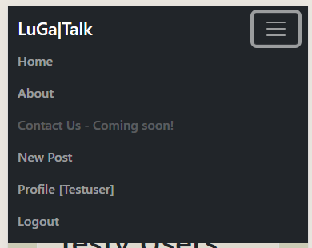

README

# LuGa|Talk

Welcome to LuGa|Talk, where the vibrant beats of Luga-flow meet the rich tapestry of Luganda, also known as Ganda, spoken by millions in Uganda.

LuGa|Talk is more than just a blog; it's a celebration of culture, language,and connection. Just as Luga-flow infuses contemporary hip-hop with traditional Ugandan rhythms, our platform intends to also blend the beauty of Luganda with modern storytelling.

Discover the rhythm and melody of Luganda as you immerse yourself in our community. Whether you're here to learn, connect, or simply explore, LuGa|Talk invites you to experience the warmthof Ugandan hospitality and embark on a journey of cultural understanding.

Join us as we delve deeper into the heart of Luganda and embrace the spirit of Luga-flow. Let's journey together towards mastering this incredible language and embracing the diversity it embodies.

 
Developer: Edgar Kimbugwe  
[Live webpage](https://lugatalk-ab90580d7f17.herokuapp.com/)

## Table of Content

1. [Project Goals](#project-goals)
    1. [User Goals](#user-goals)
    2. [Site Owner Goals](#site-owner-goals)
2. [User Experience](#user-experience)
    1. [Target Audience](#target-audience)
    2. [User Requirements and Expectations](#user-requirements-and-expectations)
    3. [User Stories](#user-stories)
3. [Database](#database)
    1. [Luga App](#luga-app)
    2. [User App](#user-app)
4. [Design](#design)
    1. [Design Choices](#design-choices)
    2. [Colour](#colours)
    3. [Fonts](#fonts)
    4. [Structure](#structure)
    5. [Wireframes](#wireframes)
5. [Technologies Used](#technologies-used)
    1. [Languages](#languages)
    2. [Frameworks](#frameworks)
    3. [Database](#database)
    4. [Tools](#tools)
    5. [Supporting Libraries and Packages](#supporting-libraries-and-packages)
6. [Methodology](#methodology)
    1. [Agile Project Management with GitHub Projects](#agile-project-management-with-github-projects)
    2. [User Stories as GitHub Issues](#user-stories-as-github-issues)
    3. [Bug Tracking](#bug-tracking)
    4. [Iterative Development Approach](#iterative-development-approach)
    5. [Backlog and Subsequent Iterations](#backlog-and-subsequent-iterations)
7. [Features](#features)
    1. [Landing Page](#landing-page)
    2. [User Pages](#user-pages)
    3. [New Post Page](#new-post-page)
    4. [Blog Post Management](#blog-post-management)
    5. [User Account Management](#user-account-management)
    6. [Navigation](#navigation)
    7. [Future Features](#future-features)
8. [Testing](#testing)
9. [Bugs](#bugs)
    1. [Known bugs](#known-bugs)
    2. [Fixed bugs](#fixed-bugs)
10. [Deployment](#deployment)
11. [Credits](#credits)
12. [Acknowledgements](#acknowledgements)

## Project Goals

At LuGa|Talk, we aim to celebrate and promote the Luganda language and Ugandan culture through engaging content and a vibrant community. Our goals reflect the aspirations of our project, our users, and the site owners, ensuring a comprehensive and enriching experience for everyone involved.

- Increase awareness and appreciation of Luganda globally by providing resources for learning and improving the language skills.
- Highlight Buganda's cultural practices and traditions through shared stories, music, and other expressions unique to Buganda.
- Create a space where Luganda speakers and learners can connect by interacting through the wesite's comments and replies section.
- Inspire Modern Storytelling by showcasing modern narratives and voices within the context of Luganda and Ugandan culture.
- Share educational resources and tools related to the Luganda language, Buganda and Ugandan culture as a whole. 

### User Goals
- Find comprehensive and accessible resources for learning Luganda
- Explore and understand Buganda culture and traditions by engaging with stories, music, and content reflecting the essence of Buganda.
- To interact with other Luganda learners and native speakers by participating in discussions, forums, and community events.
- Accessing their personal blog-posts, which will entail their added blog posts and favourite blog posts posted by other users. 
- Utilize articles, tutorials, videos, and other educational materials.

### Site Owner Goals
- Providing a platform for audience interested in learning Luganda and exploring Buganda or Ugandan culture
- Offering users the ability to Create and manage their own blog posts.
- To ensure all content added is well-researched, accurate, and engaging
- Encourage active participation from users through comments, forums, and social media
- Explore and implement monetization strategies to generate revenue for operations and growth of the site

[Back up](#table-of-content)

## User Experience

### Target Audience
At LuGa|Talk we will aim to the following target audience:

- Individuals interested in learning Luganda, from beginners to advanced learners.
- Ugandans living abroad who want to stay connected with their culture and language.
- People fascinated by Buganda culture, music, and traditions who seek to explore and understand more.
- Linguists and language enthusiasts looking to expand their knowledge of lesser-known languages.

### User Requirements and Expectations
When using the LuGa|Talk blog platform, users can expect the following features and characteristics to meet their requirements:

- Users expect tutorials, articles, and multimedia content to aid in understanding and learning about the Luganda language.
- High-quality, diverse content that is both informative and entertaining, including stories, music, and cultural insights.
- Responsive design that is intuitive, easy to navigate, and responsive across all devices.
- Personalized feature to store favorite blogs, track personal blog posts additions, and add comments to blog posts.
- Access to a diverse collection of material in regard to Luganda as a language and the cultural and tradition of Buganda / Uganda.

LuGa|Talk aims to create an engaging platform for users to explore, discover, and share their love for learning and writing on a topic of their interest, the Luganda languange.

### User Stories

#### Epic 1: User Authentication and Account Management

- [As a User I can create an account so that I can interact with blog posts.](https://github.com/Edgarkimbugwe/django-blog/issues/17) 
- [As a Registered User, I can view my profile, so that I can manage my information.](https://github.com/Edgarkimbugwe/django-blog/issues/18) 
- [As a Site Admin I can view and manage user accounts so that I can ensure the security of the site and the users.](https://github.com/Edgarkimbugwe/django-blog/issues/14) 
- [As a Site User I can create an account so that I can interact with blog posts.](https://github.com/Edgarkimbugwe/django-blog/issues/17) 

#### Epic 2: Blog post Management
- [As a Registered user I can edit my own blog posts so that I can update them when need be.](https://github.com/Edgarkimbugwe/django-blog/issues/16) 
- [As a Site User, I can view a paginated list of posts so that I can browse through the content easily without being overwhelmed by too many posts at once](https://github.com/Edgarkimbugwe/django-blog/issues/33) 
- [As a Registered User, I can create a blog post, so that I can share my thoughts and engage with the community.](https://github.com/Edgarkimbugwe/django-blog/issues/19) 
- [As a Registered User, I can like blog posts, so that they are added to my favourite posts.](https://github.com/Edgarkimbugwe/django-blog/issues/24) 
- [As a Registered User, I can comment on blog posts, so that I can share my thoughts and engage with the community.](https://github.com/Edgarkimbugwe/django-blog/issues/18) 
- [As a Registered User, I can delete my blog post, so that I can remove a post if i want to.](https://github.com/Edgarkimbugwe/django-blog/issues/20) 
- [As a Site Admin, I can create draft blog posts so that I can complete the content at a later time.](https://github.com/Edgarkimbugwe/django-blog/issues/31) 
- [As a Site Admin, I can approve or reject comments, so that the quality of discussions on the blog are effective.](https://github.com/Edgarkimbugwe/django-blog/issues/23) 

#### Epic 3: User Experience and Site Information
- [As a Site User I can see the about page of the blog so that have an insight of blogs posted](https://github.com/Edgarkimbugwe/django-blog/issues/32) 
- [As a Site User, I can browse the blog posts so that I can read articles of interest](https://github.com/Edgarkimbugwe/django-blog/issues/15) 

[Back up](#table-of-content)

## Database
LuGa|Talk uses the following database scheme:

See Database Scheme

### Luga App
This is the core component of the LugaTalk project, responsible for managing blog posts, comments, and user interactions with the content.
- Blog Post Management: Facilitates the creation, publication, and management of blog posts. This is, create, edit and delete a post. 
- Commenting System: Allows users to add comments to blog posts and ensures that comments require approval before being displayed
- User Engagement and Interaction: Enhances user engagement by allowing them to express appreciation for content by liking a post. 
- Personalized Content: To provide a personalized content experience, posts authored and liked by the logged-in user are displayed to the registered users account. 

### User App
The 'User App' handles user management, including registration, profile management, and authentication.
- User Registration and Authentication: Allows new users to register and existing users to log in and out of the system securely.
- Profile Management: Enables users to manage and update their profile information, including personal details and adding a profile pictures stored through cloud-based hosting.
- User Account and Data Handling: Ensures that user-related data is properly managed, including account deletion and related data cleanup.

[Back up](#table-of-content)

## Design
The design of the LugaTalk website is user-centric, blending modern aesthetics with intuitive navigation. It features a clean, responsive layout optimized for readability and user engagement. The design elements highlight the cultural richness of Luganda while ensuring a seamless user experience across devices.

By embracing a minimalistic design, LugaTalk ensures that the focus remains on the rich cultural content and stories shared within the community. The use of ample white space, intuitive navigation, and clear typography enhances readability, allowing the beauty of language and vibrant blog content to take center stage."

### Design Choices
The website features a minimalistic, responsive design that emphasizes readability and cultural aesthetics. The color palette, including shades like subtle pastels, enhances visual appeal and reflects the vibrancy of Luganda culture. Clear typography and intuitive navigation improve the user experience, while interactive elements like comments and likes foster community engagement

### Colour
The color palette is thoughtfully chosen to reflect the cultural richness and vibrancy of Luganda while maintaining a clean, minimalistic aesthetic. The use of subtle, harmonious colors creates a warm and inviting atmosphere without overwhelming the user. This approach enhances readability and ensures that the focus remains on the content. By avoiding background images, the design prioritizes simplicity and speed, providing a distraction-free experience that highlights the textual and visual content of the blog posts.

### Fonts
The project utilizes the default fonts provided by Bootstrap 5, ensuring a clean and professional look that enhances the overall user experience. However, users have the flexibility to customize and style fonts during content creation and editing to add their unique touch.

### Structure
The LuGa|Talk features a user-friendly and intuitive design, ensuring easy navigation and comprehension for users. It is structured into distinct sections and pages as follows:

#### Before Logged In:

- **Landing Page** Here, visitors are immediately greeted with the latest posts, reflecting the design's focus on showcasing recent content first. 
- **About Page:** The "About" page provides an introduction to LuGa|Talk, highlighting its celebration of Luga-flow and Luganda culture, language, and community engagement. 
- **Register Page:** The register page allows new users to create accounts, providing access to personalized features and community engagement. 
- **Login Page:** The login page enables registered users to securely access their accounts and interact with the platform's content and community. 

#### When Logged In:
Upon logging in, users are still directed to the most recent posts however unlike unregistered users, they can access extra functionalities through additional links which are revealed, providing access to specific profile-related pages and actions. 

- **New Post:** The "New post" page enables users to Add posts by providing a user-friendly form to input content for the blog post they want to create and have an option to apply own fonts when creating posts. . 
- **My Blog posts page:** This page allows users to view and manage their created blog post allowing them to either edit or delete them. Also this page list the users favorite posts that they have liked. 
- **Commenting:** Logged-in users have the ability to engage with blog posts by leaving comments and participating in discussions. 
- **Profile Page:** The profile page displays the user's profile information, including their bio, profile picture, and other relevant details. It allows users to update and customize their profile settings. At the top of this page, the link to the user's blog posts is available, so that the user gets access to their blog posts and liked posts under 'my favorite posts'. 
- **Logout:** The "Logout" option allows users to securely log out of their accounts, ensuring the privacy and security of their personal information. 

LuGa|Talk's structured design ensures a seamless and enjoyable user experience, allowing users to effortlessly explore, contribute to, and manage their blog posts.

### Wireframes
The wireframes visually depict various pages and features of the web application, serving as blueprints for designing each page. They provide a clear visualization of the user interface and overall user experience, created efficiently with Balsamiq—a tool designed for quick and intuitive sketching of design concepts.

Home Page (landing page)

About

Register

My Blog Postss

New Post

Login

Blog Post Detail

Profile

Logout

 

[Back up](#table-of-content)

### Languages
- HTML: Standard HTML5 structure
- CSS: For layout and styling
- Python: Used through the Django web framework to manage the backend logic, database interactions, and dynamic content rendering in templates.

### Frameworks
- Django: Utilized for building the LuGa|Talk website, providing robust and scalable web development features.
- Crispy Forms: Used to enhance form rendering, making them more efficient and customizable.
- Bootstrap v5.0: Used to create responsive and visually appealing user interfaces.
- Cloudinary: Employed for storing and serving images in the LuGa|Talk project, ensuring efficient media handling and delivery.

### Database
PostgreSQL: A database-as-a-service solution used for the LuGa|Talk project, offering reliable and scalable storage for the application's data.

### Tools
- Git: A distributed version control system utilized for tracking changes in the project's source code.
- GitHub: A web-based platform for hosting version control repositories, used for storing and managing the project's source code.
- Gitpod: An online integrated development environment (IDE) used for developing and testing the LuGa|Talk project.
- Heroku: A cloud platform for deploying and hosting web applications, used to deploy the LuGa|Talk to a live server.
- Microsoft Photos: Utilized for image manipulation and design tasks for the project.
- Balsamiq: A wireframing tool used to create mockups and prototypes for the project.
- Google Fonts: A collection of free and open-source fonts used for typography.
- Font Awesome: A library of scalable vector icons used for adding icons to the project.

### Supporting Libraries and Packages
asgiref==3.8.1: A package providing ASGI (Asynchronous Server Gateway Interface) utilities and reference implementations for Django.
cloudinary==1.36.0: A Python library for integrating Cloudinary's cloud-based image and video management services.
crispy-bootstrap5==0.7: A Django application to integrate Bootstrap 5 with Django Crispy Forms, providing enhanced form rendering.
dj-database-url==0.5.0: A utility to configure the Django database using a URL, simplifying database setup.
dj3-cloudinary-storage==0.0.6: A package enabling Django to use Cloudinary for media file storage.
Django==4.2.13: A high-level Python web framework that encourages rapid development and clean, pragmatic design.
django-cloudinary-storage==0.3.0: Another package to integrate Cloudinary with Django for media file storage.
django-crispy-forms==2.1: A Django application that improves the rendering of forms with better and customizable HTML.
django-summernote==0.8.20.0: A Django package that integrates the Summernote WYSIWYG editor for rich text editing.
gunicorn==22.0.0: A Python WSGI HTTP Server for UNIX, commonly used to run Django applications in production.
pillow==10.3.0: A Python Imaging Library (PIL) fork, adding image processing capabilities to your application.
psycopg2==2.9.9: A PostgreSQL adapter for Python, allowing interaction with PostgreSQL databases.
sqlparse==0.5.0: A non-validating SQL parser for Python, used for parsing SQL statements.
urllib3==1.26.18: A powerful, user-friendly HTTP client for Python, used for making web requests.
whitenoise==5.3.0: A tool that simplifies static file serving for Python web apps, typically used with Django for serving static files in production.

[Back up](#table-of-content)

## Methodology
The LuGa|Talk project was developed using agile principles to enhance collaboration, ensure iterative development, and improve project management. The following methodology was employed throughout the project:

### Agile Project Management with GitHub Projects
GitHub Projects has been used to facilitate agile project management serving as a Kanban board, to offer an overview of the project's progress. User stories are organized as GitHub issues, ensuring a clear and structured development approach. 

### User Stories as GitHub Issues
User stories have been meticulously crafted, interconnected as GitHub issues, detailing the desired functionality from the user's perspective. These issues are providing a seamless access to acceptance criteria, tasks, and pertinent comments for each story.

### Bug Tracking
Due to the urgency to meet deadlines, bugs encountered during development have not yet been logged in the Kanban board. However, they have been noted and the intention is to promptly log them. These bugs will be documented as GitHub issues, providing details on the specific issues, their impact, and steps to reproduce them. By linking these bugs in the README.md to their respective GitHub issues, users will be able to track the progress of bug resolution expecially by the help of related comments.

### Iterative Development Approach
The LuGa|Talk project embraces iterative development, fostering continuous improvement and progress despite the condensed timeline. This structured approach accommodates future iterations and enhancements, ensuring ongoing development and refinement within specified time constraints.

### Backlog and Subsequent Iterations 
User stories are managed on the project board, with the "To do" column serving as the backlog for subsequent iterations.

Despite the accelerated project timeline, the iterative development approach ensures continuous improvements and enhancements to adapt to evolving user needs.

For a detailed overview of project progress, user stories, and bug tracking, please refer to the [Kanban board](https://github.com/users/Edgarkimbugwe/projects/12/views/1).

[Back up](#table-of-content)

## Features
### Landing Page:
The landing page for LuGa|Talk, designed to showcase recent blog posts in a visually appealing format. It inherits from base.html and integrates features like dynamic image handling with Cloudinary and static file loading. Each blog post is presented within a responsive grid layout, featuring post titles, excerpts, author details, and publication dates. Users can navigate through paginated content and access full posts via intuitive navigation links. This page exemplifies the seamless integration of Django templates with Bootstrap for enhanced user experience and readability. 

See Screenshot

- From the Screenshot above, the navigation bar is structured in a way that when the user is not logged in or an unregistered user visits the website, they can only see, 'Login' and 'Register' on the right panel. However when the user is logged in this part of the navigation bar changes to show functions that a registered user can use. 

### User Pages:
When a user logs in, s/he is redirected to their profile page. This page has the user's own blog posts and the ones they have liked and registered as favourite blogs. At this page also to increase accesibilty for the user to navigate easily onto the website, the user is provied with links at the bottom of the page where s/he can go back to the index, view profile or create a new post, these links are also available for the user at the Navbar. 

See Screenshot

### New Post Page:
- logged in users can create new blog posts by following the New post link at the navbar or even at the bottom of their blog user page.  

See Screenshot

- Once a post has been submitted, They are informed that the post is added and pending approval from the admin. 

See Screenshot

- Once a post has been approved by the admin, the post is ready to be viewed and should appear on top of all the other previous posts. At the bottom of every post, users can see how many comments each post has got and how many times a post has been favoured/liked. Also comments can be viewed by both registered and non registered users. When a user is not logged in, they are advised to log in to leave a comment. 

See Screenshot

 
- Registered users on the otherhand can interact with other users through commenting on the blog posts by sharing either thoughts, suggestions or feedback. 

See Screenshot

### Blog Post Management:
Registered users can add, edit, and delete blogs from their profile.
- Edit their own blog posts and after updating successfully a message is shown to the user. 

See Screenshot
 
- Delete their own blog posts and be warned before talking the action to delete. 

See Screenshot
 
- Remove blog post from their favorites and be warned before talking the action to delete. 

See Screenshot

The LuGa|Talk project emphasizes CRUD functionality, allowing users to create, read, update, and delete blogs as they contribute to the language learning community.

### User Account Management:
- LuGa|Talk provides robust user account management features, allowing users to easily sign up, log in, and manage their profiles. The platform ensures secure authentication, using industry-standard practices to protect user data and maintain privacy. This enhances overall user interaction, satisfaction, and security. Such validation at creation include is: 
    - Username: required field and has a maximum of 150 characters or fewer. Letters, digits and @/./+/-/_ only.
    - First name: Set to not required at this stage
    - Last Name: Also set to not required at this stage
    - Email: required and has to be an email
    - Password: has the following constraints:
        - can’t be too similar to your other personal information.
        - must contain at least 8 characters.
        - can’t be a commonly used password.
        - can’t be entirely numeric.
    - Password confirmation
    

See Screenshot

- Upon successfully creating an account, a user gets a confirmation and asked to log in.

See Screenshot

- Users can log in to their accounts to access personalized features

See Screenshot

- Users can view and update their profile information.

See Screenshot

- Upon updating their profile a user gets a confirmation messgage.

See Screenshot

### Navigation:
- The navigation bar in LuGa|Talk provides users with an intuitive and seamless browsing experience. With links to key sections allowing users to quickly access different parts of the site. For logged-in users, the navigation bar also features options that ensures them with easy account management. The responsive design ensures that the navigation bar is accessible and user-friendly on both desktop and mobile devices where it collapses into a burger menu.

#### Unauthorized users
- When unauthorized, the navigation bar displays links to "Home", "About", "Login and "Register". 

See Screenshot

- On small screens, the navigation bar adapts to a responsive design, often collapsing into a hamburger menu to maintain usability and accessibility on mobile devices. This ensures that all navigation options remain easily accessible regardless of the screen size. 

See Screenshot

#### Authorized users
- When authorized, the navigation bar updates to include links to "New Post", Profile['logged in username']" and "logout". 

See Screenshot

 

- On small screens, the navigation bar behaves in the same way as to the non authorised user with the new links accessible to the authorised user as on big screens 

See Screenshot

### Future Features
As observed in the Todo list, there are still some exciting stories that are desire to be worked on, for now they will be adjusted to "won't have". The idea is to have all the features implemented.

- Social Media Sharing: Users will be able to share blog posts on popular social media platforms such as Facebook, Twitter, and LinkedIn. This feature will enable wider dissemination of content, allowing users to engage with a broader audience and promote LuGa|Talk across various networks.

- Sort Blog Posts: Implement sorting functionality, allowing users to sort blog posts by date, popularity, or category. This will enhance the user experience by making it easier to find the most relevant or recent content quickly and efficiently.

- Search Blog Posts: A search feature will be introduced, enabling users to search for blog posts using keywords or phrases. This will help users find specific content more easily, improving the overall usability and accessibility of the site.

- Follow Other Users: Users will have the ability to follow other users, creating a more interconnected and community-driven platform. By following other users, they can stay updated with new posts and activities from their favorite bloggers, fostering engagement and interaction within the community.

Reply to Comments: A feature that allows users to reply directly to comments on blog posts will facilitate more dynamic and threaded discussions, enabling users to engage in meaningful conversations and interactions within the comments section.

[Back up](#table-of-content)

## Testing
The LuGa|Talk website was rigorously tested to ensure robust performance, accessibility, and functionality. The comprehensive testing process included performance evaluations, browser compatibility, accessibility assessments, cross-device testing, code validation and user story testing. 

For testing details and results, [click here](TESTING.md).

[Back up](#table-of-content)

## Bugs

### Known bugs
- [Content Field Expanding Beyond Content Section on Large Screens:](https://github.com/users/Edgarkimbugwe/projects/12/views/1?pane=issue&itemId=70784683) When the screen width exceeds 1800 pixels, the content field expands to the right, beyond the content section, causing layout issues.

Attempts to Fix: Applied a @media (max-width: 1800px) query to set a max-width value for the iframe within the content field, but this approach did not resolve the issue. I intend to vast myself with skills onto this area. 

- When the user uploads a video or adds a youtube videos while creating a blogpost, this video is expanding the webpage to the right, creating undesirable extra width to the blogpost detail of that blog. I admit that this has been a challenge and i need to put some more time into and find relevant information. At the the moment when I tried to read and apply solutions that aimed at working with the iframe within the content field, nothing worked. 

### Fixed bugs
- [Unapproved Posts Appearing in Owner's Blog Posts:](https://github.com/users/Edgarkimbugwe/projects/12/views/1?pane=issue&itemId=70779798) Previously, unapproved posts were being listed in the owner's blog posts, although they were not viewable and redirected to a 404 error page. This behavior was potentially confusing for the owner. This issue was resolved, ensuring that only approved posts are displayed in the owner's blog posts section.
- [Success Message on Profile Update Opening a New Page:](https://github.com/users/Edgarkimbugwe/projects/12/views/1?pane=issue&itemId=70791965) The success message rendered to the user upon updating their profile was previously opening a new blank page instead of displaying the message at the top of the profile page. This issue has been fixed, and the success message now properly appears at the top of the profile page.

[Back up](#table-of-content)

## Deployment
The website was deployed using Heroku by following these steps:
1. Set DEBUG to False in the settings.py file.
2. Commit and push your code to the GitHub repository.
3. Clear the 'static' folder in Cloudinary to ensure the latest static files are used during deployment. This step is important to avoid any potential conflicts between cached versions of static files and the updated versions being deployed. Clearing the 'static' folder ensures that the latest versions of static files are used during the deployment process, preventing any eTag errors or inconsistencies.
4. Navigate to the project's deploy page in Heroku.
5. Choose the manual deployment option to deploy the latest code changes.

You can for fork the repository by following these steps:
1. Go to the GitHub repository
2. Click on Fork button in upper right hand corner
3. Wait for the forking process to complete. Once done, you will have a copy of the repository in your GitHub account.

You can clone the repository by following these steps:
1. Go to the GitHub repository 
2. Locate the Code button above the list of files and click it 
3. Select your preferred method for cloning: HTTPS, SSH, or GitHub CLI, and click the copy button to copy the repository URL to your clipboard.
4. Open Git Bash (or your preferred terminal).
5. Change the current working directory to the location where you want the cloned directory to be created.
6. Type the command **'git clone'** followed by the URL you copied in step 3. The command should look like this: **git clone https://github.com/YOUR-USERNAME/YOUR-REPOSITORY**.
7.Press Enter to create your local clone.

[Back up](#table-of-content)

## Credits
I would like to express my sincere gratitude to the following resources, which have been instrumental in the development of the LuGa|Talk project:

- First i would liek to appreciate, code institute 'I think I therefore blog' walk through project which gave me a clear understanding of what i have to do for my project. 

### Media
- Images are taken from [Unsplash](https://unsplash.com/)

### Django Documentation:
The official Django documentation has been an essential resource for the project, offering detailed guidance on models, forms, templates, and many other facets of Django development.
- [Models](https://docs.djangoproject.com/en/4.2/topics/db/models/)
- [Model instance reference](https://docs.djangoproject.com/en/4.2/ref/models/instances/)
- [Model Field Types](https://docs.djangoproject.com/en/4.2/ref/models/fields/#model-field-types)
- [CSRF Trusted Origins](https://docs.djangoproject.com/en/4.0/ref/settings/#csrf-trusted-origins)
- [Adding Extra Fields to a Register Form](https://forum.djangoproject.com/t/adding-extra-fields-to-a-register-form/14922)
- [Built-in template tags and filters](https://docs.djangoproject.com/en/4.2/ref/templates/builtins/)
- [Django Templates: Built-In Tags and Filters](https://realpython.com/django-templates-tags-filters/)
- [Creating forms from models](https://docs.djangoproject.com/en/4.2/topics/forms/modelforms/)
- [Signals](https://docs.djangoproject.com/en/4.2/topics/signals/)

### Other open-source projects, packages, tutorials, forums and youtube channels: 
LuGa|Talk leverages open-source projects and packages, including Django Measurement and Django Crispy Forms, significantly improving the application's functionality and user experience.

- [crispy-bootstrap5](https://github.com/django-crispy-forms/crispy-bootstrap5)
- [Django - User Profile](https://dev.to/earthcomfy/django-user-profile-3hik)
- [Django Forum - override model save method](https://forum.djangoproject.com/t/override-model-save-method/9555)
- [Stackoverflow - How to properly design my models for likes?](https://stackoverflow.com/questions/69075884/how-to-properly-design-my-models-for-likes)
- [Real Python - Build a Blog From Scratch With Django](https://realpython.com/build-a-blog-from-scratch-django/)
- [Legion Script - Build a Blog using Django, Python, and Bootstrap](https://www.youtube.com/watch?v=sMqDJovFO-Y)

## Acknowledgements
The following tutorials ([Django-Blog by Legionscript](https://github.com/legionscript/Django-Blog) and [Python Django Tutorial: Full-Featured Web App](https://youtu.be/UmljXZIypDc)), offered crucial guidance and inspiration throughout the development of this project. Essential learnings from these tutorials were:
- Blog Post Views: The tutorials provided an understanding into creating views for managing blog posts.
- Custom User Model: Detailed view on how to develop a custom user model extending the default Django user model, offering insights into adding extra fields, such as a profile image that enable more personalized user profiles.
- User Registration: Create a user registration view using the UserCreationForm, handling form validation, and displaying success messages upon successful registration.
- Profile Management: Creating views for profile editing and updating, including the use of ModelForms and handling form submissions to update the user model and associated profile data.
- Authentication and Authorization: Understanding the implemention of login and logout views using Django's built-in authentication system with an explaination of how to utilize the system's features for secure user authentication and authorization.

I would like to express my gratitude and extend my thanks to my mentor Spencer Barriball my mentor, for his indispensable feedback, advice, guidance, and unwavering support throughout this journey AND the Code Institute Slack community platform especially 'community-sweden' which has been a great source of insights and solutions to certain problems encountered througt the project.