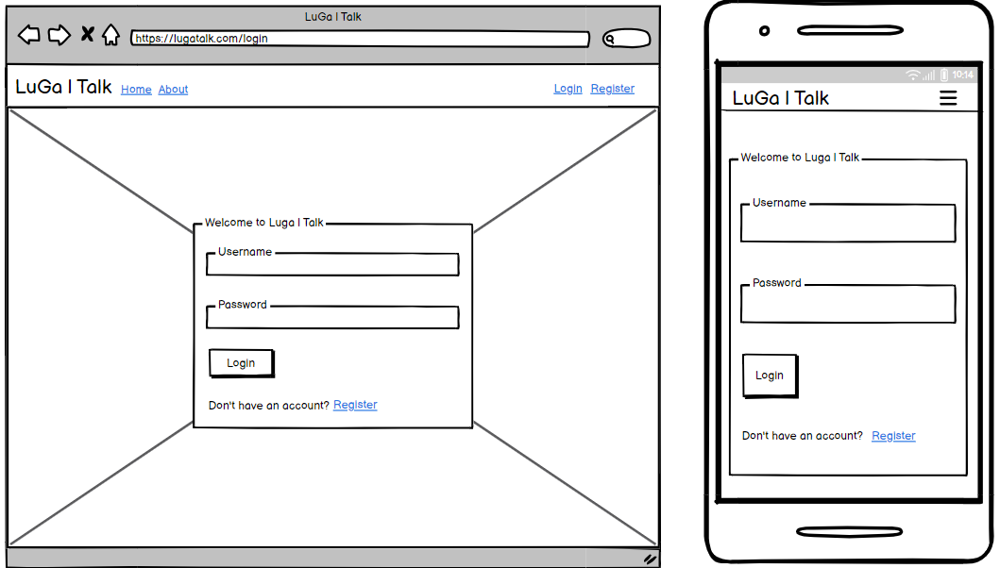

README

# LuGa|Talk

Welcome to Luga|Talk, where the vibrant beats of Luga-flow meet the rich tapestry of Luganda, also known as Ganda, spoken by millions in Uganda.

Luga|Talk is more than just a blog; it's a celebration of culture, language,and connection. Just as Luga-flow infuses contemporary hip-hop with traditional Ugandan rhythms, our platform intends to also blend the beauty of Luganda with modern storytelling.

Discover the rhythm and melody of Luganda as you immerse yourself in our community. Whether you're here to learn, connect, or simply explore, Luga|Talk invites you to experience the warmthof Ugandan hospitality and embark on a journey of cultural understanding.

Join us as we delve deeper into the heart of Luganda and embrace the spirit of Luga-flow. Let's journey together towards mastering this incredible language and embracing the diversity it embodies.

 
Developer: Edgar Kimbugwe  
[Live webpage](https://lugatalk-ab90580d7f17.herokuapp.com/)

## Table of Content

1. [Project Goals](#project-goals)
    1. [User Goals](#user-goals)
    2. [Site Owner Goals](#site-owner-goals)
2. [User Experience](#user-experience)
    1. [Target Audience](#target-audience)
    2. [User Requirements and Expectations](#user-requirements-and-expectations)
    3. [User Stories](#user-stories)
3. [Database](#database)
    1. [Luga App](#luga-app)
    2. [User App](#user-app)
4. [Design](#design)
    1. [Design Choices](#design-choices)
    2. [Colour](#colours)
    3. [Fonts](#fonts)
    4. [Structure](#structure)
    5. [Wireframes](#wireframes)
5. [Technologies Used](#technologies-used)
    1. [Languages](#languages)
    2. [Frameworks](#frameworks)
    3. [Database](#database)
    4. [Tools](#tools)
    5. [Supporting Libraries and Packages](#supporting-libraries-and-packages)
6. [Methodology](#methodology)
    1. [Agile Project Management with GitHub Projects](#agile-project-management-with-github-projects)
    2. [User Stories as GitHub Issues](#user-stories-as-github-issues)
    3. [Bug Tracking](#bug-tracking)
    4. [Iterative Development Approach](#iterative-development-approach)
    5. [Backlog and Subsequent Iterations](#backlog-and-subsequent-iterations)

## Project Goals

At Luga|Talk, we aim to celebrate and promote the Luganda language and Ugandan culture through engaging content and a vibrant community. Our goals reflect the aspirations of our project, our users, and the site owners, ensuring a comprehensive and enriching experience for everyone involved.

- Increase awareness and appreciation of Luganda globally by providing resources for learning and improving the language skills.
- Highlight Buganda's cultural practices and traditions through shared stories, music, and other expressions unique to Buganda.
- Create a space where Luganda speakers and learners can connect by interacting through the wesite's comments and replies section.
- Inspire Modern Storytelling by showcasing modern narratives and voices within the context of Luganda and Ugandan culture.
- Share educational resources and tools related to the Luganda language, Buganda and Ugandan culture as a whole. 

### User Goals
- Find comprehensive and accessible resources for learning Luganda
- Explore and understand Buganda culture and traditions by engaging with stories, music, and content reflecting the essence of Buganda.
- To interact with other Luganda learners and native speakers by participating in discussions, forums, and community events.
- Accessing their personal blog-posts, which will entail their added blog posts and favourite blog posts posted by other users. 
- Utilize articles, tutorials, videos, and other educational materials.

### Site Owner Goals
- Providing a platform for audience interested in learning Luganda and exploring Buganda or Ugandan culture
- Offering users the ability to Create and manage their own blog posts.
- To ensure all content added is well-researched, accurate, and engaging
- Encourage active participation from users through comments, forums, and social media
- Explore and implement monetization strategies to generate revenue for operations and growth of the site

[Back up](#table-of-content)

## User Experience

### Target Audience
At Luga|Talk we will aim to the following target audience:

- Individuals interested in learning Luganda, from beginners to advanced learners.
- Ugandans living abroad who want to stay connected with their culture and language.
- People fascinated by Buganda culture, music, and traditions who seek to explore and understand more.
- Linguists and language enthusiasts looking to expand their knowledge of lesser-known languages.

### User Requirements and Expectations
When using the Luga|Talk blog platform, users can expect the following features and characteristics to meet their requirements:

- Users expect tutorials, articles, and multimedia content to aid in understanding and learning about the Luganda language.
- High-quality, diverse content that is both informative and entertaining, including stories, music, and cultural insights.
- Responsive design that is intuitive, easy to navigate, and responsive across all devices.
- Personalized feature to store favorite blogs, track personal blog posts additions, and add comments to blog posts.
- Access to a diverse collection of material in regard to Luganda as a language and the cultural and tradition of Buganda / Uganda.

Luga|Talk aims to create an engaging platform for users to explore, discover, and share their love for learning and writing on a topic of their interest, the Luganda languange.

### User Stories

#### Epic 1: User Authentication and Account Management

- [As a User I can create an account so that I can interact with blog posts.](https://github.com/Edgarkimbugwe/django-blog/issues/17) 
- [As a Registered User, I can view my profile, so that I can manage my information.](https://github.com/Edgarkimbugwe/django-blog/issues/18) 
- [As a Site Admin I can view and manage user accounts so that I can ensure the security of the site and the users.](https://github.com/Edgarkimbugwe/django-blog/issues/14) 
- [As a Site User I can create an account so that I can interact with blog posts.](https://github.com/Edgarkimbugwe/django-blog/issues/17) 

#### Epic 2: Blog post Management
- [As a Registered user I can edit my own blog posts so that I can update them when need be.](https://github.com/Edgarkimbugwe/django-blog/issues/16) 
- [As a Site User, I can view a paginated list of posts so that I can browse through the content easily without being overwhelmed by too many posts at once](https://github.com/Edgarkimbugwe/django-blog/issues/33) 
- [As a Registered User, I can create a blog post, so that I can share my thoughts and engage with the community.](https://github.com/Edgarkimbugwe/django-blog/issues/19) 
- [As a Registered User, I can like blog posts, so that they are added to my favourite posts.](https://github.com/Edgarkimbugwe/django-blog/issues/24) 
- [As a Registered User, I can comment on blog posts, so that I can share my thoughts and engage with the community.](https://github.com/Edgarkimbugwe/django-blog/issues/18) 
- [As a Registered User, I can delete my blog post, so that I can remove a post if i want to.](https://github.com/Edgarkimbugwe/django-blog/issues/20) 
- [As a Site Admin, I can create draft blog posts so that I can complete the content at a later time.](https://github.com/Edgarkimbugwe/django-blog/issues/31) 
- [As a Site Admin, I can approve or reject comments, so that the quality of discussions on the blog are effective.](https://github.com/Edgarkimbugwe/django-blog/issues/23) 

#### Epic 3: User Experience and Site Information
- [As a Site User I can see the about page of the blog so that have an insight of blogs posted](https://github.com/Edgarkimbugwe/django-blog/issues/32) 
- [As a Site User, I can browse the blog posts so that I can read articles of interest](https://github.com/Edgarkimbugwe/django-blog/issues/15) 

[Back up](#table-of-content)

## Database
Luga|Talk uses the following database scheme:

See Database Scheme

### Luga App
This is the core component of the LugaTalk project, responsible for managing blog posts, comments, and user interactions with the content.
- Blog Post Management: Facilitates the creation, publication, and management of blog posts. This is, create, edit and delete a post. 
- Commenting System: Allows users to add comments to blog posts and ensures that comments require approval before being displayed
- User Engagement and Interaction: Enhances user engagement by allowing them to express appreciation for content by liking a post. 
- Personalized Content: To provide a personalized content experience, posts authored and liked by the logged-in user are displayed to the registered users account. 

### User App
The 'User App' handles user management, including registration, profile management, and authentication.
- User Registration and Authentication: Allows new users to register and existing users to log in and out of the system securely.
- Profile Management: Enables users to manage and update their profile information, including personal details and adding a profile pictures stored through cloud-based hosting.
- User Account and Data Handling: Ensures that user-related data is properly managed, including account deletion and related data cleanup.

[Back up](#table-of-content)

## Design
The design of the LugaTalk website is user-centric, blending modern aesthetics with intuitive navigation. It features a clean, responsive layout optimized for readability and user engagement. The design elements highlight the cultural richness of Luganda while ensuring a seamless user experience across devices.

By embracing a minimalistic design, LugaTalk ensures that the focus remains on the rich cultural content and stories shared within the community. The use of ample white space, intuitive navigation, and clear typography enhances readability, allowing the beauty of language and vibrant blog content to take center stage."

### Design Choices
The website features a minimalistic, responsive design that emphasizes readability and cultural aesthetics. The color palette, including shades like subtle pastels, enhances visual appeal and reflects the vibrancy of Luganda culture. Clear typography and intuitive navigation improve the user experience, while interactive elements like comments and likes foster community engagement

### Colour
The color palette is thoughtfully chosen to reflect the cultural richness and vibrancy of Luganda while maintaining a clean, minimalistic aesthetic. The use of subtle, harmonious colors creates a warm and inviting atmosphere without overwhelming the user. This approach enhances readability and ensures that the focus remains on the content. By avoiding background images, the design prioritizes simplicity and speed, providing a distraction-free experience that highlights the textual and visual content of the blog posts.

### Fonts
The project utilizes the default fonts provided by Bootstrap 5, ensuring a clean and professional look that enhances the overall user experience. However, users have the flexibility to customize and style fonts during content creation and editing to add their unique touch.

### Structure
The Luga|Talk features a user-friendly and intuitive design, ensuring easy navigation and comprehension for users. It is structured into distinct sections and pages as follows:

#### Before Logged In:

- **Landing Page** Here, visitors are immediately greeted with the latest posts, reflecting the design's focus on showcasing recent content first. 
- **About Page:** The "About" page provides an introduction to LuGa|Talk, highlighting its celebration of Luga-flow and Luganda culture, language, and community engagement. 
- **Register Page:** The register page allows new users to create accounts, providing access to personalized features and community engagement. 
- **Login Page:** The login page enables registered users to securely access their accounts and interact with the platform's content and community. 

#### When Logged In:
Upon logging in, users are still directed to the most recent posts however unlike unregistered users, they can access extra functionalities through additional links which are revealed, providing access to specific profile-related pages and actions. 

- **New Post:** The "New post" page enables users to Add posts by providing a user-friendly form to input content for the blog post they want to create and have an option to apply own fonts when creating posts. . 
- **My Blog posts page:** This page allows users to view and manage their created blog post allowing them to either edit or delete them. Also this page list the users favorite posts that they have liked. 
- **Commenting:** Logged-in users have the ability to engage with blog posts by leaving comments and participating in discussions. 
- **Profile Page:** The profile page displays the user's profile information, including their bio, profile picture, and other relevant details. It allows users to update and customize their profile settings. At the top of this page, the link to the user's blog posts is available, so that the user gets access to their blog posts and liked posts under 'my favorite posts'. 
- **Logout:** The "Logout" option allows users to securely log out of their accounts, ensuring the privacy and security of their personal information. 

Luga|Talk's structured design ensures a seamless and enjoyable user experience, allowing users to effortlessly explore, contribute to, and manage their blog posts.

### Wireframes
The wireframes visually depict various pages and features of the web application, serving as blueprints for designing each page. They provide a clear visualization of the user interface and overall user experience, created efficiently with Balsamiq—a tool designed for quick and intuitive sketching of design concepts.

Home Page (landing page)

About

Register

My Blog Postss

New Post

Login

Blog Post Detail

Profile

Logout

 

[Back up](#table-of-content)

### Languages
- HTML: Standard HTML5 structure
- CSS: For layout and styling
- Python: Used through the Django web framework to manage the backend logic, database interactions, and dynamic content rendering in templates.

### Frameworks
- Django: Utilized for building the LuGa|Talk website, providing robust and scalable web development features.
- Crispy Forms: Used to enhance form rendering, making them more efficient and customizable.
- Bootstrap v5.0: Used to create responsive and visually appealing user interfaces.
- Cloudinary: Employed for storing and serving images in the LuGa|Talk project, ensuring efficient media handling and delivery.

### Database
PostgreSQL: A database-as-a-service solution used for the LuGa|Talk project, offering reliable and scalable storage for the application's data.

### Tools
- Git: A distributed version control system utilized for tracking changes in the project's source code.
- GitHub: A web-based platform for hosting version control repositories, used for storing and managing the project's source code.
- Gitpod: An online integrated development environment (IDE) used for developing and testing the LuGa|Talk project.
- Heroku: A cloud platform for deploying and hosting web applications, used to deploy the Luga|Talk to a live server.
- Microsoft Photos: Utilized for image manipulation and design tasks for the project.
- Balsamiq: A wireframing tool used to create mockups and prototypes for the project.
- Google Fonts: A collection of free and open-source fonts used for typography.
- Font Awesome: A library of scalable vector icons used for adding icons to the project.

### Supporting Libraries and Packages
asgiref==3.8.1: A package providing ASGI (Asynchronous Server Gateway Interface) utilities and reference implementations for Django.
cloudinary==1.36.0: A Python library for integrating Cloudinary's cloud-based image and video management services.
crispy-bootstrap5==0.7: A Django application to integrate Bootstrap 5 with Django Crispy Forms, providing enhanced form rendering.
dj-database-url==0.5.0: A utility to configure the Django database using a URL, simplifying database setup.
dj3-cloudinary-storage==0.0.6: A package enabling Django to use Cloudinary for media file storage.
Django==4.2.13: A high-level Python web framework that encourages rapid development and clean, pragmatic design.
django-cloudinary-storage==0.3.0: Another package to integrate Cloudinary with Django for media file storage.
django-crispy-forms==2.1: A Django application that improves the rendering of forms with better and customizable HTML.
django-summernote==0.8.20.0: A Django package that integrates the Summernote WYSIWYG editor for rich text editing.
gunicorn==22.0.0: A Python WSGI HTTP Server for UNIX, commonly used to run Django applications in production.
pillow==10.3.0: A Python Imaging Library (PIL) fork, adding image processing capabilities to your application.
psycopg2==2.9.9: A PostgreSQL adapter for Python, allowing interaction with PostgreSQL databases.
sqlparse==0.5.0: A non-validating SQL parser for Python, used for parsing SQL statements.
urllib3==1.26.18: A powerful, user-friendly HTTP client for Python, used for making web requests.
whitenoise==5.3.0: A tool that simplifies static file serving for Python web apps, typically used with Django for serving static files in production.

[Back up](#table-of-content)

## Methodology
The LuGa|Talk project was developed using agile principles to enhance collaboration, ensure iterative development, and improve project management. The following methodology was employed throughout the project:

### Agile Project Management with GitHub Projects
GitHub Projects has been used to facilitate agile project management serving as a Kanban board, to offer an overview of the project's progress. User stories are organized as GitHub issues, ensuring a clear and structured development approach. 

### User Stories as GitHub Issues
User stories have been meticulously crafted, interconnected as GitHub issues, detailing the desired functionality from the user's perspective. These issues are providing a seamless access to acceptance criteria, tasks, and pertinent comments for each story.

### Bug Tracking
Due to the urgency to meet deadlines, bugs encountered during development have not yet been logged in the Kanban board. However, they have been noted and the intention is to promptly log them. These bugs will be documented as GitHub issues, providing details on the specific issues, their impact, and steps to reproduce them. By linking these bugs in the README.md to their respective GitHub issues, users will be able to track the progress of bug resolution expecially by the help of related comments.

### Iterative Development Approach
The Luga|Talk project embraces iterative development, fostering continuous improvement and progress despite the condensed timeline. This structured approach accommodates future iterations and enhancements, ensuring ongoing development and refinement within specified time constraints.

### Backlog and Subsequent Iterations 
User stories are managed on the project board, with the "To do" column serving as the backlog for subsequent iterations.

Despite the accelerated project timeline, the iterative development approach ensures continuous improvements and enhancements to adapt to evolving user needs.

For a detailed overview of project progress, user stories, and bug tracking, please refer to the [Kanban board](https://github.com/users/Edgarkimbugwe/projects/12/views/1).

[Back up](#table-of-content)

