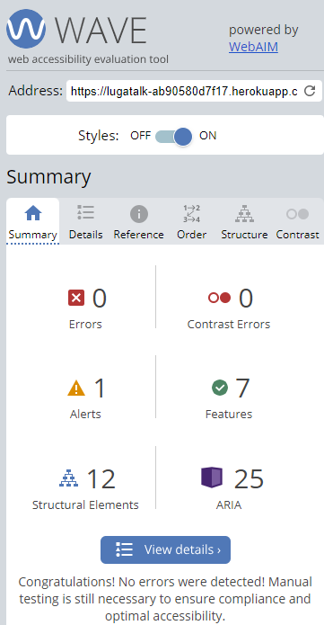

# LuGa|Talk Testing
This is an overview of the tests conducted on LuGa|Talk website to access performance evaluations, browser compatibility, accessibility assessments, cross-device testing, code validation and user story testing. Each section describes the tools used, the issues found (if any), and the corresponding test results.

## Table of Content

1. [Code Validation](#html-validation)
    1. [HTML Validation](#html-validation)
    2. [CSS Validation](#css-validation)
    3. [Python Validation](#python-validation)
    4. [Javascript Validation](#javascript-validation)
2. [Accessibility](#accessibility)
3. [Performance](#performance)
    1. [Desktop Performance](#desktop-performance)
    2. [Mobile Performance](#mobile-performance)
4. [Performing tests on various devices](#performing-tests-on-various-devices)
5. [Browser compability](#browser-compability)
6. [Manual Testing](#manual-testing)
    1. [Testing user stories](#testing-user-stories)
    2. [User Experience and Improvements](#user-experience-and-improvements)
    3. [Full testing](#full-testing)
8. [Summary](#summary)

## Code Validation

### HTML Validation
[W3C Markup Validation](https://validator.w3.org/) is a tool provided by the World Wide Web Consortium (W3C) to help web developers check the validity of their HTML, XHTML, and other markup languages. It ensures that web pages conform to the standards set by the W3C, promoting best practices and improving cross-browser compatibility. Using the validator helps identify and correct errors in code, leading to more robust and accessible web content.

- On checking the whole page for HTML validation, the following errors were registered as seeen in the image below. These errors were, bad image value attribute which was rectified by moving the styles of the image to the css file, section had been used instead of a div and then defer attibute had been applied in the link element.  

BEFORE: HTML validation

BEFORE: HTML validation

All pages were validated, and the code was pasted in. I applied a filter to remove issues related to the Django templating system. 

| **Tested** | **Result** | **View Result** | **Pass** |
--- | --- | --- | :---:
|base| No errors | 

Screenshot of result

| :white_check_mark:
|index| No errors | 

Screenshot of result

| :white_check_mark:
|about| No errors | 

Screenshot of result

| :white_check_mark:
|register| No errors | 

Screenshot of result

| :white_check_mark:
|login| No errors | 

Screenshot of result

| :white_check_mark:
|profile| No errors | 

Screenshot of result

| :white_check_mark:
|logout| No errors | 

Screenshot of result

| :white_check_mark:
|create_blogpost| No errors | 

Screenshot of result

| :white_check_mark:
|user_blogposts| No errors | 

Screenshot of result

| :white_check_mark:
|blogpost_detail| No errors | 

Screenshot of result

| :white_check_mark:
|blogpost_edit| No errors | 

Screenshot of result

| :white_check_mark:
|blogpost_delete| No errors | 

Screenshot of result

| :white_check_mark:
|remove_favorite| No errors | 

Screenshot of result

| :white_check_mark:
|delete_account| No errors | 

Screenshot of result

| :white_check_mark:
|400_page| No errors | 

Screenshot of result

| :white_check_mark:
|500_page| No errors | 

Screenshot of result

| :white_check_mark:

### CSS Validation
To validate the css code for LuGa|Talk, [W3C Jigsaw](https://jigsaw.w3.org/css-validator/) was used. A tool developed by the World Wide Web Consortium (W3C), a modular web server platform designed to explore and implement web technologies. It serves as a reference implementation of the HTTP protocol, offering a customizable framework for experimenting with new standards and functionalities. As a tool that supports validation and checks for HTML and CSS code correctness. It ensures web pages adhere to W3C standards, fostering interoperability and accessibility across different web environments.

| **Tested** | **Result** | **View Result** | **Pass** |
--- | --- | --- | :---:
|styles.css | No errors |

Screenshot of result

| :white_check_mark:
|Whole webpage | When validating the website as a whole, the validator shows warnings linked to Bootstrap v5.0. |[Result](https://jigsaw.w3.org/css-validator/validator?uri=https%3A%2F%2Flugatalk-ab90580d7f17.herokuapp.com%2F&profile=css3svg&usermedium=all&warning=1&vextwarning=&lang=en)| :white_check_mark:

### Python Validation 
[PEP 8](https://pep8ci.herokuapp.com/) was used to validate the python code for the LuGa|Talk is the official style guide for Python code, maintained by the Python Software Foundation. It outlines best practices for writing clean, readable Python code, covering topics such as naming conventions, indentation, and code structure. Adhering to PEP 8 helps maintain consistency across Python projects and enhances code maintainability and collaboration.

Note: Under 'View Result' expand the image by clicking onto it to properly view detailed information and validation results.

| **Tested** | **Result** | **View Result** | **Pass** |
--- | --- | --- | :---:
| settings | One URL was too long, while the other lines that exceeded the recommended length were automatically generated by Django. |  | :white_check_mark:
|luga/admin | All clear, no errors found || :white_check_mark:
|luga/app | All clear, no errors found || :white_check_mark:
|luga/forms | All clear, no errors found || :white_check_mark:
|luga/models | All clear, no errors found || :white_check_mark:
|luga/urls | All clear, no errors found || :white_check_mark:
|luga/views | All clear, no errors found || :white_check_mark:
|users/forms | All clear, no errors found | | :white_check_mark:
|users/models | One line too long because of URL || :white_check_mark:
|users/signals | All clear, no errors found | | :white_check_mark:
|users/views | All clear, no errors found || :white_check_mark:

### JavaScript Validation 

To validate the Javascrpit files, JS Hint was used. It is a static code analysis tool for JavaScript that helps identify potential errors and coding conventions inconsistencies in your code. It provides warnings based on predefined rules and helps improve code quality and maintainability by enforcing best practices during development.

All files with JavaScript code were tested using JS Hint and none of the files registered any warnings. These files are;
- blogpostdetail.js
- comments.js
- create.js

[Back to the top](#table-of-content)

## Accessibility
To access the accessibility of the website, [The WAVE Web Accessibility Evaluation Tool](https://wave.webaim.org/) was used to identify potential accessibility issues and provides guidance on how to improve the accessibility of web content.

The website generated no errors, not even contast errors. However there was need for accessibility improvements related to aria-labels and adjacent to each other.

See screenshort

- Removed aria-label from Blog Post Link: To improve accessibility, I removed the aria-label attribute from the blog post links. The aria-label was deemed unnecessary as it duplicated the information already present in the link text, which could confuse screen reader users. This change ensures that content is more straightforward and accessible for those using screen readers.

- Simplified Logo: Simplified the logo by removing the link from it. The logo originally linked to the same URL as the "Home" link immediately next to it, making the link redundant. By removing the link from the logo and maintaining its styling, I streamlined the navigation and reduced repetitive links, thus enhancing overall accessibility.

These changes were made to ensure a better and more accessible user experience for all visitors, including those who rely on assistive technologies.

By utilizing the WAVE tool, I obtained crucial insights into my website's accessibility. Although I have opted not to address certain issues currently, I am dedicated to ensuring an inclusive user experience. I will persist in seeking opportunities to enhance accessibility moving forward.

[Back to the top](#table-of-content)

## Performance 
The LuGa|Talk website was assessed with Google Lighthouse via Google Chrome Developer Tools. Performance scores were evaluated for both desktop and mobile devices.

### Desktop Performance
- The average score for the pages was 96/100 and the majority of the pages getting an excellent performance of 99/100

| **Tested** | **Performance Score** | **View Result** | **Pass** |
--- | --- | --- | :---:
|index| 97 / 100 | 

Screenshot of result

 | :white_check_mark:
|about| 99 / 100 | 

Screenshot of result

 | :white_check_mark:
|Register| 99 / 100 | 

Screenshot of result

 | :white_check_mark:
|login | 99 / 100 | 

Screenshot of result

 | :white_check_mark:
|profile| 80 / 100 | 

Screenshot of result

 | :white_check_mark:
|logout| 98 / 100 | 

Screenshot of result

 | :white_check_mark:
|create_blogpost| 99 / 100 | 

Screenshot of result

 | :white_check_mark:
|user_blogposts| 99 / 100 | 

Screenshot of result

 | :white_check_mark:
|blogpost_detail| 99 / 100| 

Screenshot of result

 | :white_check_mark:
|blogpost_edit| 99 / 100 | 

Screenshot of result

 | :white_check_mark:
|blogpost_delete| 99 / 100 | 

Screenshot of result

 | :white_check_mark:
|remove_favorite| 99 / 100 | 

Screenshot of result

 | :white_check_mark:
|delete_account| 81 / 100 | 

Screenshot of result

 | :white_check_mark:
|404_page| 98 / 100 | 

Screenshot of result

 | :white_check_mark:

### Mobile Performance
- The average score for the pages was 91/100 and the majority of the pages getting an impressive performance above 90/100

| **Tested** | **Performance Score** | **View Result** | **Pass** |
--- | --- | --- | :---:
|index| 88 / 100 | 

Screenshot of result

 | :white_check_mark:
|about| 93 / 100 | 

Screenshot of result

 | :white_check_mark:
|Register| 91 / 100 | 

Screenshot of result

 | :white_check_mark:
|login | 95 / 100 | 

Screenshot of result

 | :white_check_mark:
|profile| 80 / 100 | 

Screenshot of result

 | :white_check_mark:
|logout| 95 / 100 | 

Screenshot of result

 | :white_check_mark:
|create_blogpost| 80 / 100 | 

Screenshot of result

 | :white_check_mark:
|user_blogposts| 95 / 100 | 

Screenshot of result

 | :white_check_mark:
|blogpost_detail| 95 / 100| 

Screenshot of result

 | :white_check_mark:
|blogpost_edit| 85 / 100 | 

Screenshot of result

 | :white_check_mark:
|blogpost_delete| 95 / 100 | 

Screenshot of result

 | :white_check_mark:
|remove_favorite| 93 / 100 | 

Screenshot of result

 | :white_check_mark:
|delete_account| 94 / 100 | 

Screenshot of result

 | :white_check_mark:
|404_page| 95 / 100 | 

Screenshot of result

 | :white_check_mark:

The LuGa|Talk website excels in performance on both desktop and mobile devices. This high performance ensures a smooth and responsive user experience across all devices. Users can enjoy quick loading times and seamless navigation whether on any device they use.

[Back to the top](#table-of-content)

## Performing tests on various devices 
The website was tested on the following devices togeether with Google Chrome Developer Tools Device Toggeling option for all available device options.
- Samsung Galaxy S20
- Samsung Galaxy S22 ultra
- Apple iPhone 15
- Apple iphone 12 Pro Max

## Browser compability
The following browsers were used to test the website
- Google Chrome
- Microsoft Egde
- Mozilla Firefox

[Back to the top](#table-of-content)

## Manual Testing

### Testing user stories

#### As a first-time user...
| **User Story** | **Action** | **Expected Result** | **Pass** |
--- | --- | --- | :---:
|[I can create an account so that I can interact with blog posts](https://github.com/users/Edgarkimbugwe/projects/12/views/1?pane=issue&itemId=65624433)|Click on the "register" navigation link or the signup button on the about page|The user should be redirected to the register form|:white_check_mark:
|[I can see the about page of the blog so that have an insight of blogs posted](https://github.com/users/Edgarkimbugwe/projects/12/views/1?pane=issue&itemId=65671373)|Click on the "About" button in the navigation bar on the landing page|The user should be directed to the About page|:white_check_mark:
|[I can see the about page of the blog so that have an insight of blogs posted](https://github.com/users/Edgarkimbugwe/projects/12/views/1?pane=issue&itemId=65671373)|Click on the 'About' link on the left side of the navbar|The user can read about the intention of the website|:white_check_mark:

#### As a returning user...
| **User Story** | **Action** | **Expected Result** | **Pass** |
--- | --- | --- | :---:
|[I can log in to my account](https://github.com/users/Edgarkimbugwe/projects/12/views/1?pane=issue&itemId=65624433)|Press the login button on the navbar|The user should be directed to the login page|:white_check_mark:
|[I can log out of my account](https://github.com/users/Edgarkimbugwe/projects/12/views/1?pane=issue&itemId=65624433)|Press the logout button on the navbar|The user should be logged out of their account|:white_check_mark:
|[I can view my profile, so that I can manage my information.](https://github.com/users/Edgarkimbugwe/projects/12/views/1?pane=issue&itemId=65624931)|Press the profile button on the right side of the navbar|The user should be redirected to their profile page, the user can also redirect to their user blog posts and liked posts|:white_check_mark:
|[I can browse the blog posts so that I can read articles of interest](https://github.com/users/Edgarkimbugwe/projects/12/views/1?pane=issue&itemId=65624330)|Scroll down to the bottom of the webpage|If there are more than 6 blog posts, pagination is displayed to navigate through other lists|:white_check_mark:
|[I can select on a blog post so that I can get all details about it](https://github.com/users/Edgarkimbugwe/projects/12/views/1?pane=issue&itemId=65624330)|Click on 'Full post'|The user is taken to the blog post detail page|:white_check_mark:
|[I can create a blog post, so that I can share my thoughts and engage with the community.](https://github.com/users/Edgarkimbugwe/projects/12/views/1?pane=issue&itemId=65624598)|Click on the "New Post" link in the navigation bar|The user is directed to form with fields to write their post|:white_check_mark:
|[I can edit my own blog posts so that I can update them when need be.](https://github.com/users/Edgarkimbugwe/projects/12/views/1?pane=issue&itemId=65624388)|Inside the 'my blogposts' the user can press edit link beside the post they want to edit|The user is directed to the edit form and a flash message when the user clicks update|:white_check_mark:
|[I can delete my blog post, so that I can remove a post if i want to.](https://github.com/users/Edgarkimbugwe/projects/12/views/1?pane=issue&itemId=65624664)|Inside the 'my blogposts' the user can press delete link beside the post they want to edit|The user is directed to the delete page|:white_check_mark:
|[I can like blog posts, so that they are added to my favourite posts.](https://github.com/users/Edgarkimbugwe/projects/12/views/1?pane=issue&itemId=65625245)|Click on the heart icon at the end of the blog post detail page|The post is added to the users' 'my blogposts' under my favorite blogposts|:white_check_mark:
|[I can comment on blog posts, so that I can share my thoughts and engage with the community.](https://github.com/users/Edgarkimbugwe/projects/12/views/1?pane=issue&itemId=65624508)|Fill in the comment form under each blogpost detail and submit|Comment is added pending approval, only visible (faded) to the comment owner|:white_check_mark:

#### As a site owner...
| **User Story** | **Action** | **Expected Result** | **Pass** |
--- | --- | --- | :---:
|[ can view and manage user accounts so that I can ensure the security of the site and the users.](https://github.com/users/Edgarkimbugwe/projects/12/views/1?pane=issue&itemId=65605803)|Access the Django admin section and navigate to the user management section|The admin section displays all users and their associated information. The owner can perform actions such as deleting users and managing their comments|:white_check_mark:
|[I can create, read, update, and delete posts so that I can manage the blog content.](https://github.com/users/Edgarkimbugwe/projects/12/views/1?pane=issue&itemId=65625003)|Access the admin page and navigate to the blogposts management section|The admin page allows the owner to view and manage all blog posts, ensuring the quality and standards of the content|:white_check_mark:
|[I can approve or reject comments, so that the quality of discussions on the blog are effective.](https://github.com/users/Edgarkimbugwe/projects/12/views/1?pane=issue&itemId=65625115)|Access the admin page and navigate to the comments management section|The admin page allows the owner to view and manage all comments, ensuring the quality and standards of the content|:white_check_mark:
|[I can use the side bar links, so that I can have access to useful external resource about the Luganda language.](https://github.com/users/Edgarkimbugwe/projects/12/views/1?pane=issue&itemId=65625700)|Create a side bar with useful external links.|The side bar is on the right hand side of certain pages of the website|:white_check_mark:

[Back to the top](#table-of-content)

### User Experience and improvements
I conducted user testing with 10 individuals to gather feedback on their experience using the website. I asked them to perform the following tasks and provide feedback on their experience:

With help of 8 different people who undertook on different tasks below, I conducted user testing. In this way I collected information on their user experience of the website

- Create an account
- Update the profile
- Add a blogpost or more
- Update a blogpost
- Delete a blogpost
- Mark a blogpost as a favorite
- Comment on a blog post
- And test the links

### Full testing

#### Navbar unauthorized user
|**Feature**|**Expected Outcome**|**Testing Performed**|**Result**|**Pass**|
|--- | --- | --- | --- | :---:
|About|Redirects to the about page infomation with login and sign up buttons|Clicked on link "About"|about page loads and shows the login and signup buttons|:white_check_mark:
|Login|Redirects to the login page|clicked on link "Login"|loads the login page and form|:white_check_mark:
|Register|Redirects to to the signup page|clicked on the link "Register" or "Sing up" in About page|loads the sign up page and form|:white_check_mark:

#### Navbar authorized user
|**Feature**|**Expected Outcome**|**Testing Performed**|**Result**|**Pass**|
|--- | --- | --- | --- | :---:
|About|Redirects to the about page information with button directing the user to the index page|Clicked on link "About"|about page with link to index page|:white_check_mark:
|New Post|Redirects to the user to a form to add a new blog post|Clicked on "New Post" link|The "New Post" page loads, displaying a submission form|:white_check_mark:
|Profile(Username)|Redirects to the user's information and editable form|Clicked on "Profile" link|The profile page loads, displaying the user's information and an editable form|:white_check_mark:
|Logout|Logs out the user and displays a confirmation message|Clicked on "Logout"|The user is successfully logged out and redirected to a page confirming the logout|:white_check_mark:

#### Index page
|**Feature**|**Expected Outcome**|**Testing Performed**|**Result**|**Pass**|
|--- | --- | --- | --- | :---:
|Full post|Redirects to the blog post detail|Clicked on the "Full post" button|The blog post detail successfully loaded|:white_check_mark:
|Side bar links|Redirects to the each links page|Clicked on the all links|The links successfully loaded & external links open new tab|:white_check_mark:

#### Sign up page
|**Feature**|**Expected Outcome**|**Testing Performed**|**Result**|**Pass**|
|--- | --- | --- | --- | :---:
|Username|Field is required and should be a valid username format|Tested with empty field, invalid format|Error message displayed prompting the user to provide a valid username|:white_check_mark:
|Email|Field is required and should be a valid email format|Tested with empty field, invalid format|Error message displayed prompting the user to provide a valid email address|:white_check_mark:
|Password|Field is required and should meet password criteria|Tested with empty field, invalid criteria|Error message displayed prompting the user to provide a valid password|:white_check_mark:
|Password confirmation|Field is required and should match the entered password|Tested with empty field, mismatched passwords|Error message displayed prompting the user to confirm the password correctly|:white_check_mark:
|Sign up button|If the form is valid, the user is redirected to the login page with a flash message confirming successful registration and a prompt to login. If the form is not valid, an error message is displayed.|Clicked the button with valid and non-valid formats|The button functions as expected, redirecting to the appropriate pages and displaying the corresponding messages|:white_check_mark:
|Login text link|Redirects to the login page|Clicked on the "Login" link|The login page and form were successfully loaded|:white_check_mark:

#### Login page
|**Feature**|**Expected Outcome**|**Testing Performed**|**Result**|**Pass**|
|--- | --- | --- | --- | :---:
|Username|The user enters a username|Tested with valid and unvalid username input|The username field accepts and saves the valid input. If invalid it displays an error message|:white_check_mark:
|Password|The user enters a password|Tested with valid and unvalidd password input|The password field functions correctly, allowing the user to input a valid password and displays an error message when not valid|:white_check_mark:
|Sign up text link|Clicking the text link redirects to the sign-up page|Clicked on the "Sign up" text link|Successfully redirected to the sign-up page with the registration form|:white_check_mark:
|Login|If the login form is valid, the user is logged in and redirected to the appropriate page. If the form is not valid, an error message is displayed.|Tested with valid and invalid login form input|The login button functions correctly, logging in the user with valid credentials and displaying error messages for invalid credentials|:white_check_mark:

#### Update profile page
|**Feature**|**Expected Outcome**|**Testing Performed**|**Result**|**Pass**|
|--- | --- | --- | --- | :---:
|Update|When changes are made and the "Update" button is clicked, the changes should be saved, the user should be redirected to the updated form, and a flash message should confirm the update|Made changes and clicked on the "Update" button|Changes were successfully saved, redirected to the updated form, and a flash message confirmed the update|:white_check_mark:

#### Blogpost Detail page, unauthorized user
|**Feature**|**Expected Outcome**|**Testing Performed**|**Result**|**Pass**|
|--- | --- | --- | --- | :---:
|Comment icon|Shows the comment count.|No action performed on unlogged in user|No action performed on unlogged in user|:white_check_mark:
|Heart icon|No action performed on unlogged in user|No action performed on unlogged in user|No action performed on unlogged in user|:white_check_mark:
|login|Redirects to the login page|clicked on link "Login"|loads the login page and form|:white_check_mark:

#### Blogpost Detail page, authorized user
|**Feature**|**Expected Outcome**|**Testing Performed**|**Result**|**Pass**|
|--- | --- | --- | --- | :---:
|Comment|The comment is displayed with the date and username|Added a comment|The comment is successfully displayed with the corresponding date and username|:white_check_mark:
|Edit button|Only shown on the user's own comment. Takes the user to the edit comment form pre-filled with previous comment|Clicked on the update button|Updated successfully pending approval|:white_check_mark:
|Delete button|Only shown on the user's own comment. Redirects to the delete confirmation page|Clicked on the delete button|Comment deleted and redirects to the initual blogpost|:white_check_mark:
|Comment icon|Shows the comment count.|On adding an approved comment, sould increment count|Successfully increments on adding an approved comment|:white_check_mark:
|Heart icon|User cannot like their own posts|Liked another user's blog post|Successfully added to users blog posts under my favorites blogposts. Toggled between adding to favorites and removing from favorites. Flash messages confirm the action|:white_check_mark:

#### Update blog post page
|**Feature**|**Expected Outcome**|**Testing Performed**|**Result**|**Pass**|
|--- | --- | --- | --- | :---:
|Update|When changes are made and the "Update" button is clicked, the changes should be saved, the user should be redirected to 'my blogposts' page, and a flash message should confirm the update|Made changes and clicked on the "Update" button|Changes were successfully saved, redirected to 'my blogposts' page, and a flash message confirmed the update|:white_check_mark:

#### Delete blogpost page
|**Feature**|**Expected Outcome**|**Testing Performed**|**Result**|**Pass**|
|--- | --- | --- | --- | :---:
|Delete button|Deletes the blogpost and redirects to 'my blogposts' page|Clicked on the delete button|The blogpost was successfully deleted and redirected to 'my blogpost' page|:white_check_mark:
|Cancel button|Redirects to 'my blogposts' page|Clicked on the Cancel button|Successfully redirected to 'my blogposts' page|:white_check_mark:

[Back to the top](#table-of-content)

## Summary
Overall, the "LuGa|Talk" website performed well in in all testings. Certain issues that were identified during testing were rectified well as those that need to be done were left for future implementation. 